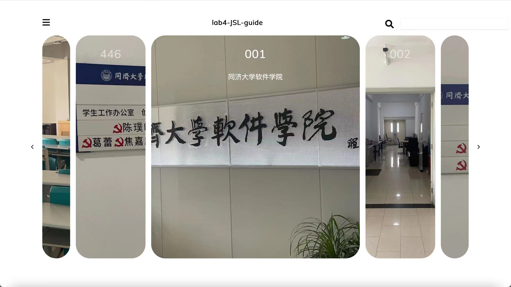
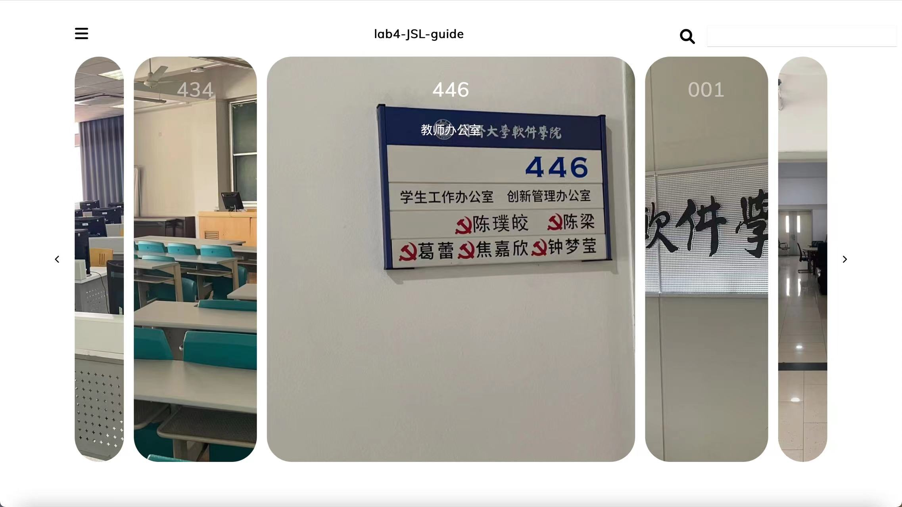
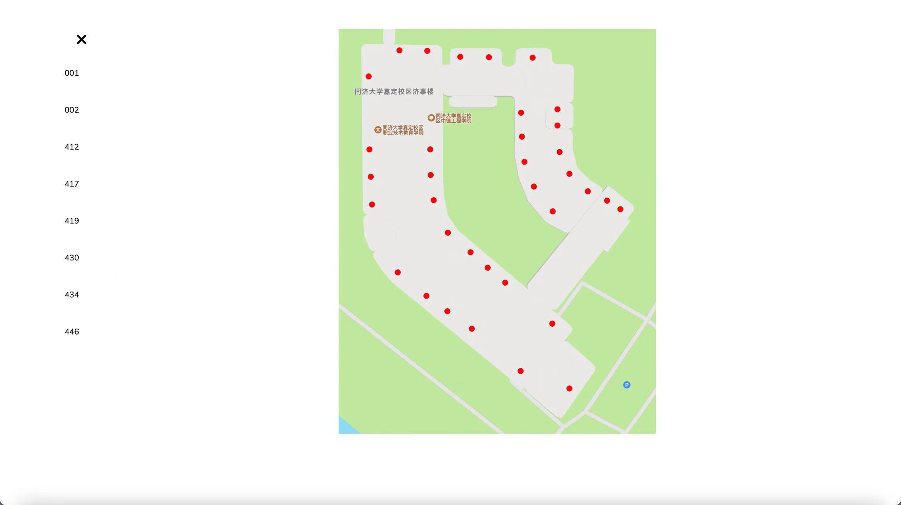
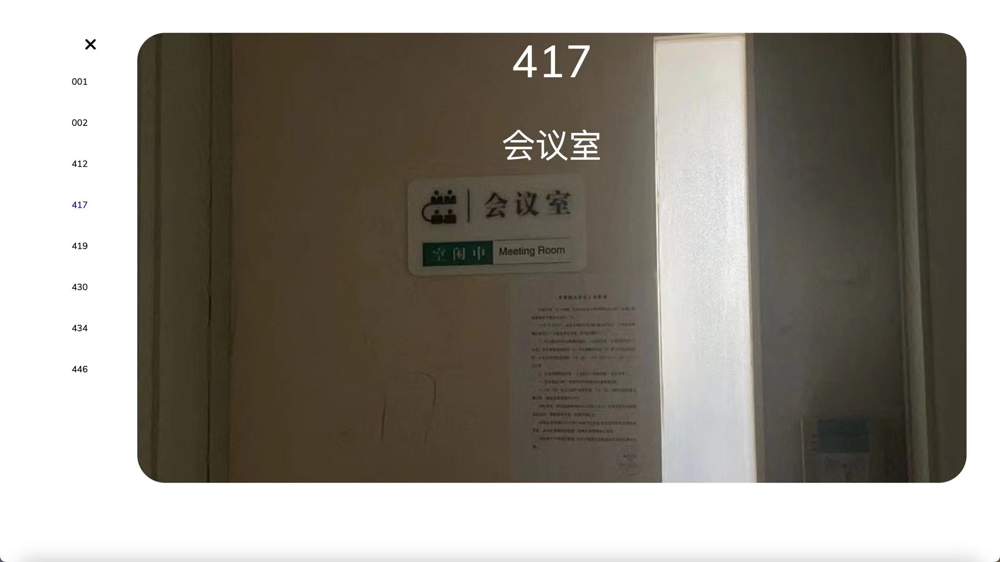
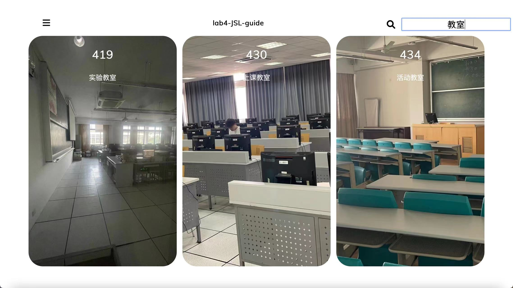

# Human-Computer-Interaction

## lab4-JSL-guide

| name      | Student Id |
| --------- | ---------- |
| Liu Chang | 2054164    |

[toc]

### System Requirement

Guide mobile phone APP on the 4th floor of Jinan Building. Users can visit each room in the system, understand the purpose of each room and the people in the room.

1. Provides an overview of all rooms on the 4th floor of the Lodge.
2. Users can quickly select a room to view.
3. Support keyword query (for example, search: Student Affairs office or Grey).

4. Design (one or more) interfaces of the navigation system, drawing and designing web pages;

In combination with fluid navigation principle in courseware, explain the reasons for designing this interface layout and interaction mode.

### Functionalities Demonstration

This project directly uses native `html+css+javascript` to complete, directly use the browser to open the `index.html` file.

The implemented functions include the following:

1. Show a panoramic view of each room and the rooms next. On the large image in the middle, the room number and room description are shown. In the middle, only the room number is displayed. On the outermost side, no text information is displayed.



2. We can switch rooms with the arrows on either side, and their relative order will not change. For example, if you switch to the left, the whole thing moves one space to the left.



3. Clicking on the top left sidebar button displays all the recorded room numbers and their relative positions on the map.



4. The user can also select one of them for specific viewing.




5. Users can also do a keyword search based on the room number and description of the room, such as "classroom", and all the ones with classroom in the name will be displayed.



### Advantages

The layout and interaction of this project, combined with the principles of fluid navigation, have lots of advantages.

1. Providing panoramic views: The interface displays panoramic views of each room and their adjacent rooms. This design allows users to have a clear understanding of the layout and connections of the entire space. Specific information about each room, such as room number and description, is shown on the large image in the middle. Only the room number is displayed in the center, keeping the interface clean and straightforward. No text information is displayed on the outermost side, reducing visual distractions and providing a better browsing experience.
2. Room switching with arrows: Users can switch rooms using the arrows on either side. By maintaining the relative order of the rooms, users can easily navigate between rooms. For example, when switching to the left, the entire layout moves one space to the left. This continuous switching method helps users establish a sense of continuity in the space, making the navigation process smoother and more intuitive.
3. Sidebar button for displaying room information: Clicking the top left sidebar button displays all recorded room numbers and their relative positions on the map. This provides users with a quick overview of the room layout. Users can gain an understanding of the overall structure of the space through the sidebar, further enhancing their spatial awareness.
4. Selecting specific rooms for viewing: Users can select specific rooms from the sidebar to view in detail. This allows users to quickly locate rooms of interest and delve into their specific information. By providing the ability to browse specific rooms, users have the freedom to explore and understand different parts of the space.
5. Keyword search: Users can perform keyword searches based on room numbers and room descriptions, such as searching for "classroom." The system will display all rooms with "classroom" in their names. This search feature enables users to quickly filter and locate rooms based on specific criteria, enhancing the usability and efficiency of the interface.

Through these designs and interactions, the project's layout adheres to the principles of fluid navigation, providing an intuitive, consistent, and efficient user experience. Users can easily navigate and explore the entire space, locate specific rooms, and access relevant detailed information, thereby better understanding and utilizing the space.

### Detailed Design

1. The overall layout is specified by html, and the body section is split into header, which contains the sidebar buttons, title, and search box, and main, which contains the content body.

```html
<body>
  <header>
    <nav>
      <i class="fas fa-bars"></i>
      <h1>lab4-JSL-guide</h1>
      <div>
        <i id="search" class="fas fa-search"></i>
        <input id="search-content" type="text">
      </div>
    </nav>
  </header>
  <main>
    <div class="container"></div>
    <div class="sidebar">
      <ul class="room-ul"></ul>
      <div class="panel sidebar-image"></div>
    </div>
  </main>
</body>
```

2. During the loading process, the javascript creates the left and right arrows, adds an event listener, clears the page content when clicked, and then calls the custom updatePanels function to re-render.

```javascript
const left_arrow = document.createElement('div')
left_arrow.addEventListener('click', () => {
    container.innerHTML = ""
    curRoom = (curRoom + rooms.length - 1) % rooms.length
    updatePanels(curRoom)
})
left_arrow.style = "display: flex; flex-direction: column; justify-content: center; align-items: center;"
left_arrow.innerHTML = `<i class="fas fa-chevron-left"></i>`
left_arrow.classList.add("left-arrow")

const right_arrow = document.createElement('div')
right_arrow.addEventListener('click', () => {
    container.innerHTML = ""
    curRoom = (curRoom + 1) % rooms.length
    updatePanels(curRoom)
})
right_arrow.style = "display: flex; flex-direction: column; justify-content: center; align-items: center;"
right_arrow.innerHTML = `<i class="fas fa-chevron-right"></i>`
right_arrow.classList.add("right-arrow")
```

3. The custom function `updatePanels(curRoom)` renders the page based on the current room number, `curRoom`. We get the container from the dom, add a left arrow to it, and then add five div tags, setting their backgrounds and contents, and their class names.

```javascript
const map_class_name = [
    { className: 'left-2' },
    { className: 'left-1' },
    { className: 'middle' },
    { className: 'right-1' },
    { className: 'right-2' }
]
const container = document.querySelector('.container')
function updatePanels(curRoom) {
    container.appendChild(left_arrow)
    map_class_name.forEach(data => {
        idx = map_class_name.indexOf(data)
        const panel = document.createElement('div')
        panel.classList.add('panel', data.className)
        let room = rooms[(curRoom + idx) % rooms.length]
        panel.style.backgroundImage = room.backgroundImage
        panel.innerHTML = `
            <h3 style="opacity: 0;">${room.name}</h3>
            <p style="opacity: 0;">${room.description}</p>`
        container.appendChild(panel)
    })
    container.appendChild(right_arrow)
}

updatePanels(curRoom)
```

4. Different class names correspond to different styles, which are defined in `index.css`. We use flex layout to control the scale.

```css
.panel.middle {
  flex: 15;
}
.panel.left-1 {
  flex: 5;
}
.panel.right-1 {
  flex: 5;
}
.panel.right-2 {
  flex: 2;
}
.panel.left-2 {
  flex: 2;
}
```

5. For the **search** function, we listen for the keyboard event in the search box, when the keyboard is released, we get the value of the search box, if it is not null and not an empty string, we first clear the contents of the container, then iterate over all the rooms and display the room if it contains the searched term. If none of the rooms meet the requirements, the search result is prompted to be empty.

```javascript
search = document.getElementById('search-content')
search.addEventListener('keyup', () => {
    if (search.value !== null && search.value != "") {
        container.innerHTML = ""
        rooms.forEach(room => {
            if (room.name.includes(search.value)
            || room.description.includes(search.value)) {
                const panel = document.createElement('div')
                panel.classList.add('panel', 'middle')
                panel.style.backgroundImage = room.backgroundImage
                panel.innerHTML = `
                    <h3 style="opacity: 0;">${room.name}</h3>
                    <p style="opacity: 0;">${room.description}</p>`
                container.appendChild(panel)
            }
        })
        if (container.childNodes.length == 0) {
            const panel = document.createElement('div')
            panel.classList.add('panel', 'middle')
            panel.style.backgroundImage = "url('./image/no-result.png')"
            panel.innerHTML = `
            <p style="opacity: 1; color: black; margin: 50px">
                搜索结果不存在
            </p>`
            container.appendChild(panel)
        }
    } else {
        container.innerHTML = ""
        updatePanels(curRoom)
    }
})
```

6. When the sidebar button is clicked, the `sidebar` element is given the `active` class, and the original `transform: translateY(-100%);` property is overridden with `transform: translateY(0);`. This causes the previously hidden sidebar to be displayed. 

   Inside the sidebar, all the rooms from the `rooms` array are added. Each `li` element is associated with an event listener: when a room is clicked, the corresponding image and description of that room will be displayed on the right side. JavaScript closures are used here to avoid the issue of the `room` parameter always being the last item in the `forEach` loop.

```javascript
bars = document.querySelector('.fa-bars')
image = document.querySelector('.sidebar-image')

const room_ul = document.querySelector('.room-ul')
rooms.forEach(room => {
    const room_li = document.createElement('li');
    (function(room){
        room_li.addEventListener('click', function() {
            image.innerHTML = `
                <h3>${room.name}</h3>
                <p>${room.description}</p>`
            image.style.backgroundImage = room.backgroundImage
            image.style.backgroundSize = "cover"
            room_ul.childNodes.forEach(node => {
                node.classList.remove("selected")
            })
            room_li.classList.toggle("selected")
        })
    })(room)
    room_li.innerHTML = `<p>${room.name}</p>`
    room_ul.appendChild(room_li)
})

const sidebar = document.querySelector('.sidebar')
bars.addEventListener('click', () => {
    bars.classList.toggle('fa-times')
    sidebar.classList.toggle('active')
})
```

